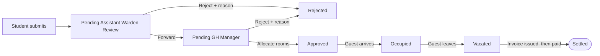
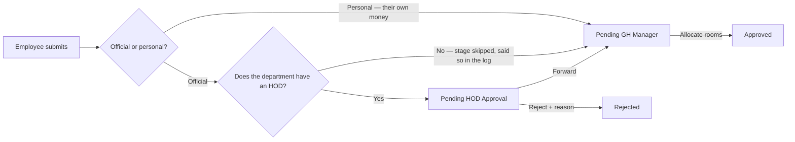
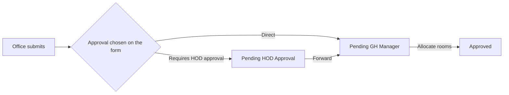
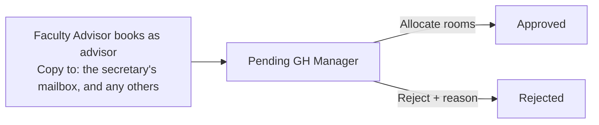
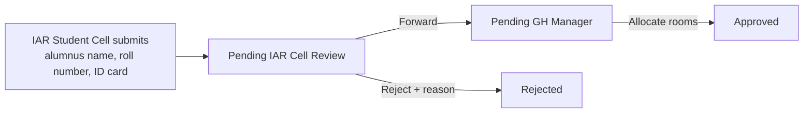
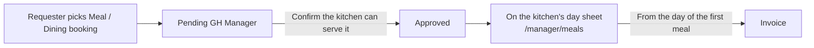
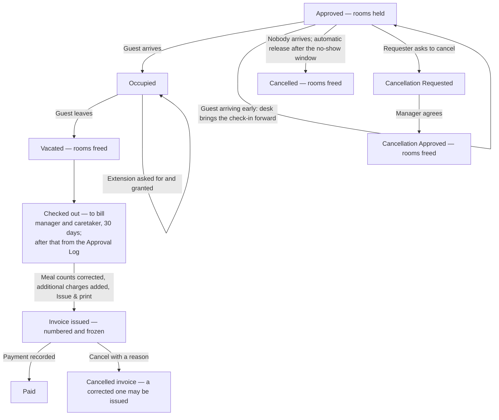
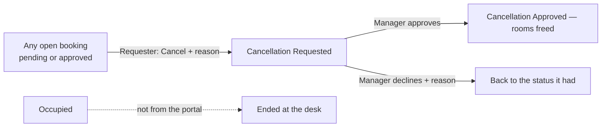

# Roles, workflows and notifications — the life of a request

Who may do what, where a request travels, and what the portal sends at each
step. One file, because the three answers are one story: a role decides what a
person may raise, the route decides who sees it next, and the mail is what
happens when it moves.

**Checked against the code on 10 Oct 2026** — `lib/access.ts`, `lib/routes.ts`,
`lib/workflow.ts`, `lib/units.ts`, `lib/club-booking.ts`, `lib/mail/*`, every
page's guard and every server action's gate. If this file and the code
disagree, the code is right and this file is a bug.

| Looking for | Go to |
| --- | --- |
| What a role is **asked** on New Booking | [11-booking-forms.md](11-booking-forms.md) |
| What may be **charged**, and the invoice | [13-billing-and-dining.md](13-billing-and-dining.md) |
| The **demo account** for a role | [05-credentials-and-security.md](05-credentials-and-security.md) |
| Which **values** are configurable | [12-settings-and-defaults.md](12-settings-and-defaults.md) |

---

## Part 1 — The roles

### At a glance

| Role (`profiles.role`) | Label in the portal | Lands on | Books? | Approves? | Desk | Console |
| --- | --- | --- | --- | --- | --- | --- |
| `student` | Student | `/dashboard` | Personal stays for family | — | — | — |
| `employee` | Employee (Faculty & Staff) | `/dashboard` | Official or personal; meals only; **as Faculty Advisor** when named on a council | As **HOD** / club head if appointed | — | — |
| `official` | Official / Dignitary | `/dashboard` | Official only, if whitelisted; meals only | — | — | — |
| `club` | Club / Fest Council | `/dashboard` | **No** — its Faculty Advisor books for it | — | — | — |
| `iar_student_cell` | IAR Student Cell | `/dashboard` | On behalf of an alumnus only | — | — | — |
| `iar_cell` | IAR Office | `/iar` | Official or for an alumnus; meals only | The Student Cell's requests | — | — |
| `warden` | Assistant Warden | `/warden` | — | Students of their hostel | — | — |
| `gh_manager` | Guest House Manager | `/manager` | At the desk, for a guest (official / alumni) | Final stage of everything | Everything | 10 of 14 sections |
| `gh_caretaker` | Guest House Caretaker | `/caretaker` | — | — | Check-in/out, extend, invoices | — |
| `developer` | Developer (Superadmin) | `/admin` → `/admin/users` | — | — | Invoices | All 14 sections |
| `faculty_advisor` | Faculty Advisor | `/approvals` | *Legacy account type* — only if named on a council | Legacy club stage | — | — |
| `alumni` | Alumni (via IAR, legacy) | `/availability` | **Retired** — kept only because stored bookings carry it | — | — | — |

**Approvers by appointment are not roles.** An HOD is whoever heads a
department (or an office's HOD unit) in Departments & Clubs; a council
secretary is the student who heads a council; a **Faculty Advisor** is the
professor named on a council or club. All three are ordinary accounts
(`employee`, `student`) that gain a queue or a booking option because the
console names them — change the name there and the queue or option moves.

---

### Signing in — every role

- **LDAP username + password** on `/sign-in` (also embedded in the public
  `/book-room` and `/book-meal`). Until `LDAP_URL` is set, the dummy directory
  in `lib/ldap/mock-directory.ts` answers. The username is matched to a
  portal account through `profiles.ldap_uid`; a valid LDAP login with no
  portal account gets "not registered". Unknown user and wrong password get
  one message. **8 attempts per username per 15 minutes** (a row in the
  database, `RATE_LIMITS.signIn`).
- **Mock Authentication** (the second button) — the one-click persona picker
  at `/mock-login`, open while Google sign-in is not configured
  (`mockLoginEnabled()`), closed by `MOCK_LOGIN=false`. When
  `GOOGLE_CLIENT_ID` + `GOOGLE_CLIENT_SECRET` + `APP_URL` are set, the same
  button is **Sign in with Google** (real OpenID Connect; institute domains
  only; must match an existing portal account) and the picker 404s.
- **Session**: a row in `sessions`, opaque cookie (`__Host-gh_session` in
  production), **30 minutes idle, 12 hours absolute**. "Switch user" signs out
  to `/sign-in`. One browser = one session: signing in as someone else in one
  tab changes every tab (use a private window for two people at once).
- **Developer only:** a TOTP second factor, and proving it again within 10
  minutes before role changes, Settings changes and any delete.
- **Console password** (default `0000`) guards `/admin` for the manager and the
  developer; an unlock lasts 8 hours; 6 attempts per 15 minutes.

---

### Every signed-in role

| Feature | Where | Notes |
| --- | --- | --- |
| **Room Availability** | `/availability` (nav, every role) | **Two different answers since 7 Oct 2026.** The **manager, caretaker and developer** (`SEES_ROOMS`) get the Day / Week / Month chart per guest house, the turnaround, accepted overlaps, maintenance and the room-by-room list — and the manager and developer alone see who and why (`CAN_SEE_OCCUPANT`). **Everyone else is sent a count and no rooms at all**: **how many rooms are free**, as a labelled strip of figures per day — redrawn 9 Oct 2026 — or a headline figure plus hour chips on a single day, with the full sentence on each cell's `aria-label`. The booking form's panel is the same component. Max 62 days per request. |
| **Booking History / Approval Log** | `/history` (nav, every role) | Requesters: their own bookings ("Booking History"). Staff: their jurisdiction ("Approval Log"), with "Handled by me / Everything in scope". Keyword search with `ref:`, `guest:`, `room:`, `by:`, `purpose:`, `gh:`, `status:` prefixes; date presets as one grouped `<select>`, and the thirteen stage / three meal tick boxes behind a **"Stages and meals"** disclosure that names what it is holding (9 Oct 2026); **CSV and PDF export for every role** — both re-derive the user, the scope and the filters server-side from the query string alone. |
| Public website | `/`, `/guidelines`, `/gallery`, `/contact`, `/privacy` | Open to anyone, signed in or not. |

---

### Requesters

Everything a requester can do with a booking they own (or raised for a club):

- **Start one** from the large tiles at the top of My Bookings (26 Sep 2026):
  **New room booking** (vermilion) for every requester who books for
  themselves, **Meal booking** (ink, `/book?service=meals_only`) for
  `MEALS_ONLY_ROLES` where a guest house serves meals, and **Book for
  <club>** for a Faculty Advisor. New Booking stays in the menu too.
- **See it** on My Bookings (`/dashboard`) — status, rooms once allocated, the
  rejection reason, the full log, and the invoice once issued (download).
- **Ask to cancel** — any booking not yet closed and not already Occupied, with
  a reason. It always becomes **Cancellation Requested** and the manager
  decides (approve → Cancellation Approved, rooms freed; decline → back to the
  status it had). A guest already in the building is ended at the desk.
- **Ask to extend** a stay (new check-out + reason); the manager decides.
- **Download my data** / **Ask for erasure** (DPDP), a quiet ruled line of
  links at the foot of My Bookings (9 Oct 2026 — it was a tinted notice).
- The guest house office's contact (+91 491 209 2016, ghm@iitpkd.ac.in — the
  same as the website and the invoice) is in the **portal footer** on every
  signed-in page. It used to be a "Facing trouble booking?" notice on My
  Bookings and at the foot of the booking form; both are gone (9 Oct 2026).

#### Student

- **Books:** personal stays for family (not asked — the type is recorded
  silently). **Bageshri only and no meals** — a rule since 7 Oct 2026
  (`restrictedToOneGuestHouse`, `mealsAllowedFor`), checked on the server, not
  merely a consequence of Bageshri having no kitchen. **No debitable head is
  asked at all** (7 Oct 2026): the money is their own, the server records
  Personal Funds, and a **Payment** card states that the invoice is settled at
  check-out.
- **Father and Mother come from their academic record and are locked**
  (7 Oct 2026, migration 28): choosing the relationship fills the name in
  read-only, a parent the record does not name is not offered, and Guardian
  appears only where it names neither. Siblings and grandparents are typed.
  **No Aadhaar and no ID document** is demanded for a guest the record named.
  ("Fill in from saved details" and "Yourself" were withdrawn for every role
  on 7 Oct.)
- **Route:** Assistant Warden of the hostel on their profile → GH Manager.
- **Special rules:** relationship dropdown with the parent rule (siblings and
  grandparents only alongside Mother / Father / Guardian) and one-of-each
  (one Mother, one Father…); the banner "Double shared rooms will get first
  preference"; booking window 1 month; at most 14 nights.
- **Menu:** My Bookings · New Booking · Room Availability · Booking History.

#### Employee — faculty

- **Books:** **Official** (default) or **Personal**; Room, Room + Meals, or
  **Meals only** where a guest house serves meals (Hamsanandi). Both guest
  houses.
- **Route:** official → **HOD** of their department → GH Manager (the HOD
  stage is skipped, and logged, when nobody other than the requester heads the
  department); personal → straight to the GH Manager.
- **Debitable heads (official, room):** PDF / Project / Department / Special
  Budget / Personal — the office's "all funds **except** Institute Grant,
  Alumni, Student Fund and Hostel" (8 Oct 2026), and those four are a floor,
  not just a default. Dining: the same, less Project. Personal: **not asked** -
  Personal Funds, recorded by the server (7 Oct 2026). **Any head but Personal
  Funds asks for the funds declaration.**
- **Guest details:** only **name and gender** are mandatory; no ID upload.
- **Also, when appointed:** HOD Queue (`/hod`) if they head a department;
  Club Approvals if they head a club/council; **Booking as: Faculty Advisor —
  X** on New Booking if named Faculty Advisor of a council or club (next
  section).
- **Menu:** My Bookings · New Booking · (HOD Queue) · (Club Approvals) ·
  Room Availability · Booking History.

#### Employee — non-teaching staff

As faculty, except the debitable heads: **Personal Funds only** (room and
dining) since the office's list of 8 Oct 2026 - their official hosting is
raised by the office or department that is paying, which has its own list. So
they are never asked for the funds declaration either. The category comes from
`profiles.staff_category`; an employee with none set is treated as faculty.

#### Faculty Advisor (a professor, by appointment)

The student bodies are a hierarchy — **Faculty Advisor → student secretary
(Technical Affairs, Cultural Affairs…) → clubs**; a fest (Petrichor) has an
advisor of its own. The advisor is **a field on the council or club**
(`units.faculty_advisor_id`, migration 25), set by the developer or manager in
Departments & Clubs → Faculty Advisors, because the post is a 1–2 year
contract. A club with none of its own takes its council's.

- **Books:** from their own faculty login, New Booking shows **Booking as:
  Yourself / Faculty Advisor — <council or club>**. Choosing the advisor
  option opens the **club's** form (`/book?for=<club profile id>`).
- **The booking is the club's:** its account (`user_id`), official, the club's
  debitable heads (**Student Fund / Special Budget**, 8 Oct 2026), the club's
  guest form.
  `created_by` is the professor.
- **Route: straight to the GH Manager** — nobody forwards it, HOD included.
- **Copy to** starts with the council secretary's mailbox
  (`units.secretary_email`, e.g. `sec_arts@iitpkd.ac.in`); removable, and
  more can be added.
- The professor sees it on their own My Bookings ("For Petrichor"), may cancel
  or ask to extend it, is CC'd on every mail to the club about it, and can
  **never approve it**.
- Who may be named: any `employee` not in non-teaching staff, or a legacy
  `faculty_advisor` account. Nobody named → nobody can book for the club.

#### Official / office (Director's Office, Registrar, a department's office)

- **Must be on the official whitelist** (Settings; default `admin@`,
  `director.office@`, `registrar@iitpkd.ac.in`, plus the demo `cse.office@`) — otherwise New Booking
  redirects to My Bookings and the server refuses.
- **Books:** official only (not asked); Room, Room + Meals, Meals only; both
  guest houses. **Exempt from the 1-month window and the 14-night cap.**
- **Chooses per booking:** **Direct** (straight to the GH Manager) or
  **Requires HOD approval** (its own head for an officer office; the parent
  department's HOD for a department office). Stored on the booking.
- **Debitable heads:** one list for both classes of office as a *category*
  (8 Oct 2026) - Institute Grant, Department Budget, Special Budget, Student
  Fund, Hostel Funds, Alumni Fund - **then narrowed to this office's own row**
  on the office's spreadsheet (9 Oct 2026,
  [04-production.md](04-production.md),
  `lib/office-debit-heads.ts`). So the Director's Office is offered Institute
  Grant and Special Budget, a department office its department's budget and
  Special Budget, the Students Section the student and hostel funds, the
  Sports Officer the grant alone. **Project Grant and Personal Funds are on no
  office's row.** An office the spreadsheet does not name keeps the six. The
  office class decides the approval route, and never the heads.
- **Guest details:** only **gender** is mandatory.
- Highlighted and sorted to the top of the manager's queue; Hamsanandi rate
  ₹4,000 (the "government officers" tariff).

#### Club / fest / council account

The shared mailbox of a club, a fest or a council (a council's account *is* its
secretary's mailbox, e.g. `sec_arts@`).

- **Cannot book.** New Booking is not in its menu; `/book` explains who its
  Faculty Advisor is ("Ask your Faculty Advisor to book"); the server refuses a
  submission.
- **Sees** every booking raised for it on My Bookings, **gets every requester
  mail** about them, and may ask to cancel or extend them.
- **Menu:** My Bookings · Room Availability · Booking History.

#### IAR Student Cell

- **Books only on behalf of an alumnus** (its "Official" option was withdrawn;
  office bookings are the IAR Office's). Must give the alumnus's **name**,
  **roll number** and **Alumni ID card** (JPG/PNG/WEBP/PDF, 5 MB). Alumni
  stays are at **Bageshri** (stated, no dropdown), which serves no meals, so in
  practice a room booking; meals-only is not open to it.
- **Route:** IAR Office → GH Manager.
- **Debitable heads:** **Alumni Fund / Special Budget** - the alumni category
  since the office's list of 8 Oct 2026.
- **Menu:** My Bookings · New Booking · Room Availability · Booking History.

#### IAR Office (books *and* approves)

- **Books:** Official or On behalf of an alumnus; meals only too; Direct or
  Requires HOD approval (it is an office). Its own requests never go to
  `PENDING_IAR` — that would be approving itself.
- **Approves:** the IAR Student Cell's requests at **IAR Queue** (`/iar`),
  with the alumni ID card shown.
- **Debitable heads:** official → **Special Budget / Alumni Fund** - the six
  of the offices' category list narrowed to `iar`'s own row on the office's
  spreadsheet (9 Oct 2026); alumni → **Alumni Fund / Special Budget** (8 Oct
  2026). The two come out the same, by different routes.
- **Approval Log:** alumni requests, the Student Cell's, and its own.
- **Menu:** My Bookings · New Booking · IAR Queue · Room Availability ·
  Approval Log.

---

### Approvers

Every approver: **Forward** (to the next stage of the booking's route) or
**Reject with a reason** (mandatory, shown to the requester verbatim). A
request whose check-in passed while it waited has **lapsed** and can only be
rejected — and since 7 Oct 2026 the **nightly job marks it `MISSED`**, tells
the requester and takes it out of every queue, so nothing sits unanswered for
ever. Only the manager can put one back. Nobody can ever act on a request they
submitted or raised. Approvers
get **one daily digest**, not a mail per request, and a nudge (CC the
manager) when something has waited over **48 hours**.

#### Assistant Warden

- **Queue:** `/warden` — **Pending Assistant Warden Review** for students
  whose profile hostel matches theirs (exact text). Their own academic record
  card sits below the queue.
- **The student's record beside each request** (25 Sep 2026): the Review
  dialog shows the student's academic record — roll number, programme,
  phone, **father's, mother's (or guardian's) name**, hostel — and each Father
  / Mother / Guardian on the request against the name on record (matches /
  partly matches / differs / not on record). The queue row says **✓ Matches
  record** or **⚠ Check names**. Only the requests in their own queue; the
  record is shown, never stored or mailed.
- **Approval Log:** student requests from their hostel. No hostel on their
  profile → an explanation instead of a log.
- **Cannot book.** Menu: Assistant Warden Queue · Room Availability ·
  Approval Log.

#### HOD (by appointment)

- Whoever is the **head or acting head** of a department in Departments &
  Clubs (or of the unit an office or club answers to — `hod_unit_id`).
- **Queue:** **HOD Queue** (`/hod`) — **Pending HOD Approval** for requesters
  in units whose HOD unit they head. Never their own request (an HOD's own
  official booking skips the stage unless an acting HOD is set).
- **Approval Log:** their own bookings plus requests from the units they
  govern.

#### Council secretary / club head (a student, by appointment) — legacy stage

Heads a council or club in the console. **Club Approvals** (`/approvals`)
lists **Pending Club Approval** requests — which today only exist for club
requests stored before 24 Sep 2026, since clubs no longer submit. A
`faculty_advisor` account keeps the same page (name-matched to the club as a
fallback). Their mailbox (`units.secretary_email`) is copied on bookings the
Faculty Advisor raises.

---

### The desk

#### Guest House Manager (`gh_manager`)

**Manager Console** (`/manager`), one tab per guest house:

- **Incoming room requests** — Pending GH Manager, official (whitelisted)
  requests first. **Review & Allocate** opens the room grid for the booking's
  own dates only: green free, red taken (disabled), hatched turnaround (a gap
  shorter than the buffer), amber soft overlap (≤ 2 h); the manager may accept
  the last two. Capacity, extra beds needed and a formal occupancy line are
  shown. **Confirm & Allocate** holds the rooms and approves in one step.
  **Reject** needs a reason.
- **Incoming meal bookings** — their own section since 1 Oct 2026, because a
  meal booking has no check-in, no check-out and nothing to allocate: the days
  and sittings, the head count and the vegetarian / non-vegetarian split, and
  **Review & Approve**, which is the whole decision. **Reject** needs a reason
  there too.
- **Checking out today**, **Current occupants**, **Awaiting check-out**,
  **Checked out — to bill** (vacated in the last 30 days, unpaid),
  **Upcoming stays**, **Missed requests** (nobody decided them in time; the
  last 21 days — 7 Oct 2026) and **Awaiting payment** (every issued, unpaid
  invoice, **with no cut-off** — 7 Oct 2026).
- **Mark Occupied** (from 2 hours before check-in, never earlier) / **Mark
  Vacated** — except a **personal** stay, whose row shows **Check out &
  settle** instead: its check-out is the invoice (issue → pay → vacate, in one
  dialog, 7 Oct 2026). The manager alone may close one off unpaid, with a
  reason that goes in the log.
- **Reinstate** a Missed request: it goes back to the stage it was waiting at,
  with a reason; its dates then need moving from Manage.
- **Manage** a stay: a **later check-out**, or **Move check-in** either way
  (earlier for an early arrival, later for a late one — 1 Oct 2026); approve /
  decline a requester's extension; move
  rooms (reason, audited); release a no-show; change dates or meals; cancel;
  reinstate a cancelled or rejected booking.
- **Cancellation requests:** approve (rooms freed) or decline (reason).
- **New booking for a guest** (`/book`): books on someone's behalf — official
  or on behalf of an alumnus, never personal — with the guest's name required;
  may override the alumni-at-Bageshri rule (logged). Exempt from the booking
  window and the stay cap.
- **Invoices:** preview, correct meal counts, **add additional charges with
  comments** (extra bed, broken vase — 25 Sep 2026), issue & print, **mark
  paid by UPI or account transfer** (cash withdrawn 7 Oct 2026; a reference is
  required), **cancel** (the manager and developer only).
- **Kitchen** (`/manager/meals`): plates per meal per day, confirmed and
  pending dining, "Dining to invoice".
- **Console** ("Settings" in the menu → `/admin/users`), behind the console
  password: Users & Roles (cannot create or edit a developer), Departments &
  Clubs (incl. Faculty Advisors), Projects, Tariffs & Invoicing (incl. invoice
  settings), Guest Houses & Rooms (maintenance blocks, bulk rooms, serves
  meals), Form Builder, Email Templates, Mail Outbox, Security (own sessions +
  the office's DPDP data requests).
- Sees names on Room Availability; PDF and collections CSV on the Approval Log.
- **Menu:** Manager Console · Settings · Room Availability · Approval Log.

#### Guest House Caretaker (`gh_caretaker`)

A deliberate **subset** of the manager's console — reception.

- **Reception** (`/caretaker`): Checking out today, Current occupants,
  Awaiting check-out, **Checked out — to bill**, Upcoming stays, and
  **Awaiting payment** (every issued, unpaid invoice, no cut-off — 7 Oct
  2026; a personal meal booking is settled here at the guest house).
- **Mark Occupied / Vacated**; a **personal** stay is checked out through
  **Check out & settle** instead (issue → pay → vacate). Reception **cannot**
  close one off unpaid — that is the manager's. **Extend a stay** — later
  check-out, or **Move check-in** earlier or later (1 Oct 2026).
- **Invoices:** preview, correct meal counts, **add additional charges**,
  issue & print, mark paid (UPI or transfer) — **not cancel**.
- **Kitchen** (`/manager/meals`): a **Meal counts** button on Reception for a
  guest house that serves meals; the kitchen page's back link returns to
  Reception.
- Approval Log over everything; collections CSV.
- **No** allocation, approvals, cancellations, bookings or console.
- **Menu:** Reception · Room Availability · Approval Log.

---

### Developer (`developer`)

- **Developer Console** (`/admin`), behind the console password **and** a TOTP
  second factor; step-up within 10 minutes for role changes, Settings and
  deletes.
- **All 14 sections** — the manager's ten plus four that are developer-only:
  **All Bookings** (force a status — audit-logged, refuses Occupied before
  check-in — and hard delete), **Settings** (the rules, hostels, official
  whitelist), **Audit Log**, **Console Access** (the console password).
- Can assign any role, including developer; cannot delete themselves or drop
  their own developer role.
- Issues and marks invoices paid, may cancel them; sees names on
  availability; PDF export.
- **Does not book.** Booking on someone's behalf is the manager's desk alone
  (`canBookOnBehalf`), so `/book` sends the developer back to the console and
  the public "Book a room" pages offer "Go to your portal" (fixed 24 Sep 2026 —
  it used to open a form with no booking types that could never be submitted).
- **Menu:** Developer Console · Room Availability · Approval Log.

---

### Who can open which console section

| Section | Path | Manager | Developer |
| --- | --- | --- | --- |
| Users & Roles | `/admin/users` | ✓ (not developer accounts) | ✓ |
| ↳ **Import from spreadsheet** — paste the office's own columns, check the plan, import; all or nothing (8 Oct 2026) | same | ✓ | ✓ |
| ↳ Import LDAP usernames — `email, uid` pairs onto existing accounts | same | ✓ | ✓ |
| ↳ **Tick rows and delete together**, behind a typed confirmation (8 Oct 2026) | same | ✓ (not developer accounts) | ✓ |
| Departments & Clubs (+ Faculty Advisors) | `/admin/units` | ✓ | ✓ |
| **Academic records** (the institute's records, pasted in as CSV — migration 28, 7 Oct 2026) | `/admin/academic` | ✓ | ✓ |
| Projects | `/admin/projects` | ✓ | ✓ |
| Tariffs & Invoicing | `/admin/billing` | ✓ | ✓ |
| Guest Houses & Rooms | `/admin/guest-houses` | ✓ | ✓ |
| Form Builder | `/admin/forms` | ✓ | ✓ |
| Email Templates | `/admin/mail-templates` | ✓ | ✓ |
| Mail Outbox | `/admin/mail` | ✓ | ✓ |
| Security (sessions, 2FA, data requests) | `/admin/security` | ✓ | ✓ |
| All Bookings | `/admin/bookings` | — | ✓ |
| Settings | `/admin/settings` | — | ✓ |
| Audit Log | `/admin/audit` | — | ✓ |
| Console Access | `/admin/access` | — | ✓ |

Every section's actions re-check the role and the unlock on the server
(`requireConsole(section)`), not just the page.

---

## Part 2 — The pipelines and the states

**Approval by appointment.** An HOD is whoever heads the unit *now* (Console →
Departments & Clubs), not whoever holds a particular role: a council secretary
is a student, an HOD is an employee. Change the head and the waiting requests
move with them — nothing is stamped onto the booking. A **Faculty Advisor** is
the same idea for booking rather than approving: the professor named on the
council (migration 25), changed there when the one- or two-year appointment
ends.

**Nobody approves their own request.** `canReview` refuses it outright, and
routing skips a stage the requester would be approving themselves.

---

### The pipelines

#### A student's stay

The warden is scoped to their own hostel: `warden.hostel_name` must match the
student's. Since 25 Sep 2026 the warden reviews each request beside the
student's academic record, with every Father / Mother / Guardian on the
request checked against the names on file (`lib/academic/family.ts`).

#### An employee's stay

Faculty and non-teaching staff take the same route; the debitable heads on
offer differ (`lib/debit-heads.ts`).

#### An office's stay (Director's Office, a department office, the IAR Office)

The choice is stored on the booking (`office_approval`), so the route cannot
change under a waiting request. An officer office (`office_class = 'officer'`)
is debited to the Institute Grant; a department office to the Department.

#### A club's, fest's or council's stay

The student bodies are a hierarchy: **Faculty Advisor → student secretary
(Technical Affairs, Cultural Affairs…) → clubs**, and a fest has an advisor of
its own. Since 24 Sep 2026 none of them books for itself: the **Faculty
Advisor** — a professor named in Departments & Clubs, the club's own else its
council's — books for it from their own login (`/book?for=<club>`, "Booking
as"). The booking is the club's — its account, its debitable heads — with the
professor as `created_by`, and **nobody forwards it**.

A club request stored before the rule (demo booking 2) still takes the old
route: Pending Club Approval with the council secretary first, then the HOD
where the club has one.

#### An alumnus's stay

Alumni have no institute login, so nobody books as one: the IAR Office or the
Student Cell raises it for them.

#### Dining (meals only, no room)

Lunch for a visitor is the kitchen's business; the approval stages exist to
vouch for an overnight stay, so a meals-only booking skips them all. No room is
held, nobody is checked in, and the bill may be issued from the day of the
first meal.

#### The desk, once a stay is approved

#### A requester cancels

A requester (or the Faculty Advisor who raised a club booking) never cancels
outright: every cancel is a request the manager decides, pending bookings
included. The manager cancels directly (`managerCancelBooking`), and the
developer can force any status from the console.

**Moving the dates at the desk** (manager or caretaker): a later check-out, or
the check-in **in either direction** ("Move check-in") — an approved or current
stay, at most 60 days either way, never past the check-out, refused if another
stay (or its turnaround) holds one of the rooms by then. Earlier because a
guest arriving a day early could not otherwise be marked Occupied, which is
refused before the booked check-in; **later** (1 Oct 2026) because a guest
arriving a day *late* had a stay that had already begun on paper, so the
register disagreed with the building and the first night was billed to
somebody who was not in it.

A room is held exactly while the booking is in a room-holding status, so
check-out, cancellation and the no-show release all free the room with no
separate step. What the room *was* is kept on the booking's room cards, because
that is what the invoice is priced from.

---

### The states

| Status | Meaning | Who moves it on |
| --- | --- | --- |
| `PENDING_WARDEN` | With the student's Assistant Warden | Warden |
| `PENDING_FA` | With the club's advisor or council secretary | That person |
| `PENDING_HOD` | With the department's head | HOD |
| `PENDING_IAR` | With the IAR Office | IAR Office |
| `PENDING_GH_MANAGER` | Waiting for rooms | Manager |
| `APPROVED` | Rooms held, guest not yet in | Desk |
| `OCCUPIED` | Guest in the building | Desk |
| `VACATED` | Guest gone, room free | Manager (the bill) |
| `CANCELLATION_REQUESTED` | Requester asked to cancel (from any open status) | Manager |
| `CANCELLATION_APPROVED` | Cancelled at the requester's ask | — |
| `REJECTED` | Refused, with a reason the requester sees | — |
| `CANCELLED` | Cancelled by the office, or released as a no-show | — |
| `MISSED` | **Nobody decided it before the check-in passed** — or, for a meal booking, before its last day of meals (migration 29, 7 Oct 2026). Set by the nightly job, never by a person | Manager, who can **reinstate** it |

A stay is only ever shown as Occupied once it has actually started
(`displayStatus`): a guest admitted early reads as Approved with the arrival in
the log, because a badge saying "Occupied" on a booking for next week is a lie
the desk has to argue with.

**`MISSED` is not a rejection.** Nobody decided anything, which is why it has
a status of its own and why it can be undone: **Reinstate** on the manager's
console returns the request to **the stage it was waiting at**
(`statusBeforeMissed`, read from the log entry that marked it), with a reason
that goes in the log. Its dates are in the past by then, so the manager's next
move is to move them (Manage) and allocate — which is what they did with a
"lapsed" request before this status existed. A reinstated request is **never
marked again**: `missedSweepable` reads the reinstatement structurally off the
log, as a row whose `previous_status` is MISSED.

---

### What happens automatically

| When | What | Where |
| --- | --- | --- |
| Every submission and decision | Mail to the actioner, copy to everyone who has signed it off so far | `lib/mail/notify.ts` |
| Every mail to the requester | Copied to the booking's own **Copy to** addresses (New Booking — pre-filled with the council secretary's mailbox when a Faculty Advisor books), and on a club booking to the Faculty Advisor who raised it | `requesterCopyTo` in `lib/mail/recipients.ts`, `defaultCopyToFor` in `lib/club-booking.ts` |
| Every night | **Requests nobody decided in time are marked Missed**, logged and mailed to the requester (before the digest, so a dead request is out of the queues first); no-show release; ID-number erasure past the retention window; audit trimming | `/api/mail/cron` (Vercel Cron) — `runMissedSweep` in `lib/missed-server.ts` |
| Every few minutes | The mail outbox is dispatched | `/api/mail/dispatch` |
| Any change to bookings, holds, blocks or invoices | Open desk screens re-fetch | `components/live-updates.tsx` |
| Any change to Settings, guest houses or rooms | The public site's cached data is expired | `lib/revalidate.ts` |

---

### Where each rule actually lives

| Question | Answer in code |
| --- | --- |
| Who reviews this? | `routeFor`, `approvalStagesFor`, `canReview` / `canReviewBooking` (`lib/workflow.ts`) |
| Has this request run out of time? | `hasLapsed` / `lapseDeadline`, and `missedSweepable` for the nightly job (`lib/workflow.ts`) |
| Can this one be put back? | `reinstateMissedError`, `statusBeforeMissed` (`lib/workflow.ts`); the action is `reinstateMissedBooking` |
| Who may book for a club? | `facultyAdvisorOf` (`lib/units.ts`), `facultyInChargeOf`, `clubsBookableBy` (`lib/club-booking.ts`) |
| Who heads this unit? | `approversOf`, `hodApproversFor` (`lib/units.ts`) |
| May this role open this page? | `lib/access.ts`, and each page's own guard |
| What may be charged? | `invoiceBlocker`, `buildInvoiceDocument` (`lib/invoice.ts`) |
| How long may a stay be, how far ahead? | `lib/settings.ts` (`rules.booking`), applied by `lib/booking-schema.ts` |
| When may the desk check someone in? | `occupancyNotStartedError` (`lib/workflow.ts`) |
| Which rooms are free? | `room_holds` and `room_blocks` in the database, `lib/availability.ts` on top |

The public `/guidelines` page is rendered from the same modules
(`lib/site-content.ts` → `lib/site-data.ts`), so the rules the institute reads
are the rules the form applies.

---

## Part 3 — Every automatic mail

### Every event

| Event key | What | To | CC |
| --- | --- | --- | --- |
| `booking.submitted.requester` | Booking received | Requester | Booking's Copy to (+ the Faculty Advisor on a club booking) |
| `booking.submitted.reviewer` | New request awaiting review | First actioner (warden / HOD / IAR Office / club stage / manager) | Approval chain ("Copy to" card) |
| `booking.tier_approved.requester` | Approved at a tier | Requester | Booking's Copy to |
| `booking.pending.reviewer` | Forwarded for review | Next actioner | Approval chain (incl. who forwarded) |
| `booking.rejected.requester` | Rejected — the reason verbatim | Requester | Booking's Copy to |
| `booking.allocated.requester` | Rooms allocated, check-in, what ID to carry | Requester | Booking's Copy to |
| `booking.allocated.desk` | Allocation record | Manager + caretaker | Approval chain |
| `booking.cancellation_requested.manager` | Cancellation requested | Manager | Approval chain |
| `booking.cancellation_decided.requester` | Cancellation approved / declined | Requester | Booking's Copy to |
| `booking.cancelled.requester` / `.desk` | Cancelled (by the office) | Requester / the desk if rooms were held | Copy to / approval chain |
| `booking.extension_requested.manager` | Requester asked to extend | Manager | Approval chain |
| `booking.extension_decided.requester` | Extension approved / declined | Requester | Booking's Copy to |
| `booking.no_show.requester` | Released as a no-show | Requester | Booking's Copy to |
| `booking.missed.requester` | **Nobody decided the request in time** (7 Oct 2026, migration 29) — the check-in passed, or a meal booking's last day of meals. Careful about blame: the requester did nothing wrong, so it says what happened and names the two things they can do | Requester | Booking's Copy to |
| `stay.reminder.requester` | Day before check-in | Requester | Booking's Copy to |
| `queue.digest.reviewer` | Daily digest of waiting requests | Each reviewer with a non-empty queue | — |
| `queue.escalation.reviewer` | Waiting over 48 h | Reviewer | Manager |
| `desk.daily_report` | Day-wise log per guest house (arrivals, departures, in house, awaiting check-out, pending allocation, kitchen plates) | Manager + caretaker | — |
| `invoice.issued.accounts` | Official invoice, PDF attached; the summary lists Room charges, Dining charges (unlettered since 30 Sep 2026 — the invoice's letters changed with its version) and — since 25 Sep 2026 — Other charges (no GST) when there are any | Accounts email (Setting) | Requester's HOD, the requester (+ Copy to) |
| `booking.cancellation_requested.reviewer` | *Retired* — reviewers are CC on the manager's mail now | — | — |

**Two different "Copy to" lists — keep them apart.** The **approval chain**
(`lib/academic/copy-to.ts`: everyone who approves any stage of the booking's
route, plus an office's head) is CC on **staff** mail. The **booking's own
Copy to** (`bookings.copy_to_emails`, typed on New Booking, ≤ 25; pre-filled
with the council secretary when a Faculty Advisor books) is CC on
**requester** mail, together with the Faculty Advisor who raised a club
booking (`requesterCopyTo`).

Every template's wording can be overridden in Console → Email Templates
(subject, intro, outro, extra CC, on/off); the facts in the mail stay in code.

### Scheduling

| Route | Does | Schedule (`vercel.json`, Hobby plan) |
| --- | --- | --- |
| `/api/mail/cron` | No-show release (if the Setting > 0) → **mark requests nobody decided in time as Missed** (7 Oct 2026, before the digest, so a dead request is out of the queues first) → purge dead sessions / throttles → retention erasure → digests, reminders, desk reports, escalations → drain the outbox. The response reports a count per job, `missed` among them | `30 2 * * *` (08:00 IST) |
| `/api/mail/dispatch` | Drain the outbox (safety net — mail normally leaves within a second via `after()`) | `0 3 * * *` (Hobby allows daily crons only; `*/10` on Pro) |

Both need `CRON_SECRET` as a bearer token in production (a GET is accepted only
with Vercel's `x-vercel-cron` header). Every job is idempotent per institute
day, so a missed run self-heals and a double run sends nothing.

### How it works

Built 16 Sep 2026. Two Administration Section requirements (allocation mail,
the day-wise log) plus the meeting note about single-threaded email, all of
which needed the same missing piece.

#### The shape

| File | What it is |
| --- | --- |
| `types.ts` | `Mailer`, `OutboundMessage`, the `MailEventKey` union, the outbox row |
| `config.ts` | Env reading, `portalUrl()`, `cronAuthorized()` |
| `index.ts` | `getMailer()` — picks the transport from the environment |
| `smtp.ts` | `SmtpMailer` (nodemailer, pooled) |
| `file.ts` | `FileMailer` → `.local-mail/*.eml`, and `DryRunMailer` |
| `redirect.ts` | `MAIL_REDIRECT_ALL_TO`, applied at **send** time |
| `render.ts` | Blocks → HTML **and** plain text, from one description |
| `templates.ts` | What each mail says. Pure functions, no store access |
| `thread.ts` | Per-booking and daily per-person thread roots and subjects; the `[reference]` subject for mail with no thread (the console's test message) |
| `recipients.ts` | Who gets told — via `canReview()`, never a re-derived rule; `copyToAddresses()` for CC |
| `addressing.ts` | `addressStaffMail(to, copyTo)`: CC minus anyone in To, de-duplicated ignoring case |
| `notify.ts` | `notify*()` per workflow event: queue, then `after()` a dispatch |
| `dispatch.ts` | The worker: claim → send → settle, with backoff |
| `digest.ts` | The scheduled jobs (digests, reminders, desk report, escalations) |

Transport is chosen the way `lib/store/index.ts` chooses a backend:

| Condition | Transport | Mail goes to |
| --- | --- | --- |
| `MAIL_DRY_RUN=true` | `DryRunMailer` | nowhere (one log line) |
| `MAIL_USER` + `MAIL_APP_PASSWORD` | `SmtpMailer` | the SMTP host |
| otherwise | `FileMailer` | `.local-mail/*.eml` |

The file mailer exists for the same reason `MockStore` does: a first run needs
no credentials and no network. Open an `.eml` in any mail client to see exactly
what a recipient would have got.

#### Nothing sends inside a server action

Actions **queue**; `lib/mail/dispatch.ts` sends. Three reasons, and the third
is the one that bites silently:

1. A slow SMTP host would add its latency to every booking submission.
2. A failed send must not fail a booking that is already stored.
3. On a serverless host, un-awaited work is frozen the moment the function
   responds — mail started and not awaited simply vanishes.

So `notify.ts` writes to `email_outbox` (migration 10) and schedules a dispatch
with `after()` from `next/server`, which runs once the response is out. The
cron route is the safety net for anything queued while SMTP was down.

**Every `notify*()` swallows its own errors.** If migration 10 is not applied,
or a profile has no address, the booking still succeeds and the failure is a
log line. A notification is worth less than the request it describes.

#### The hooks are in the actions, not in `updateBookingStatus()`

Tempting, and wrong. The store method sees a status pair; only the action knows
*why* — which reason the reviewer typed, which rooms the manager picked,
whether a cancellation was approved or declined. Hooking the store would mean
reconstructing intent from a status transition, and would also mail on the
developer console's **force-status override**, which is a repair tool: a
developer fixing a bad row should not send a parent a confirmation.

#### What is sent — To is the actioner, "Copy to" is CC

The owner's rule (Phase 2, 21 Sep 2026): on every **staff** mail about a
booking, **To is the one person who must act next** — found through
`canReview()` for the booking's current status (`reviewersForStatus`), or the
desk for a desk record — and **CC is the booking's Copy-to list**
(`lib/academic/copy-to.ts`): everyone who approves any stage of its chain
(`approvalStagesFor`) and, for an office, its head (Departments & Clubs
console first, else the academic record). `addressStaffMail` removes anyone
already in To from CC and de-duplicates both ignoring case. When the booking
moves on, the next mail's To moves with it and the approver who forwarded it
stays in CC.

**Requester mail has its own CC** (24 Sep 2026, `requesterCopyTo()` in
`lib/mail/recipients.ts`): the addresses the requester added under **Copy to**
on New Booking (`bookings.copy_to_emails`), and — on a club booking raised by
its Faculty Advisor — that professor, since the To is the club's account. Every "Requester" row below carries it, as do the check-in reminder
and the official invoice to Accounts. Staff mail does not: an outsider has no
use for "awaiting your review". Two different lists both called Copy to — the
card's (approvers, staff CC) and the booking's (named by the requester,
requester CC).

| Event | To | CC | Carries |
| --- | --- | --- | --- |
| Submitted | Requester | — | Reference, summary, "nothing needed yet" |
| Submitted | First actioner (warden / advisor or council secretary / HOD / IAR Office / manager) | Copy to | Who asked, a link to their queue |
| Tier approved | Requester | — | Progress, what happens next |
| Tier approved | Next actioner | Copy to (incl. who forwarded it) | Who forwarded it |
| Rejected | Requester | — | **The reason, verbatim** |
| Rooms allocated | Requester | — | Room numbers, check-in, what ID to carry |
| Rooms allocated | Manager + caretaker | Copy to | Copy for the desk register |
| Cancellation requested | Manager (decides) | Copy to (whoever reviewed it) | Reason; rooms stay held until they decide |
| Cancellation decided | Requester | — | Outcome, and that the booking stands if declined |
| Cancelled | Requester (unless they did it); desk if rooms were held | Copy to, on the desk mail | Reason |
| Day before check-in | Requester | — | Rooms, directions, what to bring |
| Daily | Each reviewer with a non-empty queue | — | One digest, not one mail per request |
| Daily | Manager + caretaker | — | Per guest house: the day-wise log |
| Pending > 48 h | Reviewer | Manager | Escalation nudge |

The separate "Cancellation requested — for your information" mail to
reviewers (`booking.cancellation_requested.reviewer`) was retired: they are CC
on the manager's mail instead. The key stays in the union for old outbox rows
and is hidden from the template editor (`RETIRED_MAIL_EVENTS`).

`email_outbox.cc_emails` has existed since migration 10, and every transport
already sent CC (`SmtpMailer`, `FileMailer` writes a `Cc:` header,
`DryRunMailer` logs it), so Phase 2 needed **no migration** — the change is who
goes in it. Addresses the office adds to a template's CC in Email Templates are
merged into the same CC line.

**Digests matter more than they look.** Per-request mail to a warden during
fest week trains them to filter the portal into spam, and then the portal stops
working. The manager is deliberately *not* digested — their pending
allocations are a section of the daily desk report, and two mails listing the
same queue is how a report stops being read.

#### Recipients come from `canReview()`

`reviewersFor()` filters profiles through the very predicate that decides
whether their button works. Re-deriving "wardens of this hostel" in the mail
layer would be a second copy of the scoping rule, and the two would drift — the
Malhar warden would start getting mail about Saveri students while still,
correctly, being unable to act on them. `canReview` also refuses
`reviewer.id === requester.id`, so the IAR Office is never asked to approve its
own booking.

#### Threads: one conversation per booking, for everyone

From the meeting notes: *"Email — try to send in a single thread instead of a
standalone email."* **Every mail about one booking joins that recipient's
thread for that booking** - the requester's as well as the staff's, since the
office asked on 8 Oct 2026 to "keep all emails for the same booking id in one
email thread". The scheduled mail that has no booking (digest, escalation,
desk report) joins a **daily log** thread instead, because it is about a queue
and a new institute day starts a new one. Two things must line up for mail
clients to group messages:

1. `bookingThreadRoot(referenceId, address)` — or `dailyThreadRoot("daily_log",
   day, address)` for the scheduled mail — is a deterministic root
   `Message-ID`; the first message actually **sent** claims it (decided in
   `dispatch.ts`), and every later one sets `In-Reply-To` / `References` to it.
2. Every message in a thread shares the thread's subject
   (`[IITPKD-GH-2026-AB12C] Guest house booking`, or `Guest house daily log —
   Mon 21 Sep 2026`); what the message is about moves to its heading and inbox
   preview.

Threaded mail is queued **one message per To address** (a message carries one
`References`). **CC rides on the first To's message only**, so a copied
warden or HOD receives it once and it joins that recipient's thread — every
later message about the same booking to the same To carries the same root.

> **Was per person per *day* until 23 Sep 2026.** Threading on the day grouped
> by when a message happened to be queued, so unrelated requests shared a
> conversation and one booking's messages were split across days. See
> [02-decisions.md](02-decisions.md), "Mail threads on the booking, not on the
> day".

> **Requester mail stood alone until 8 Oct 2026.** The meeting notes' reasoning
> was that each step is news to the person who asked, and it still is - each
> message still arrives, with what happened leading its heading and its inbox
> preview. What standing alone cost was the trail: a requester with three
> bookings in a fest week had nine loose messages whose only connection was a
> reference id they had to notice and search for. The price of the thread is
> the shared subject, which is the same trade the staff mail made in
> September. `invoice.issued.accounts` threads on the booking too, so Accounts
> keeps one conversation per stay rather than one per document.

#### HTML and text from one description

`render.ts` takes a list of blocks (`paragraph`, `facts`, `callout`, `table`,
`list`, `button`, `note`) and renders both bodies. A template that wrote the
two separately would drift until the text part was wrong — and the text part is
what every HTML-refusing client and every screen reader reads.

Email constraints baked into the markup: tables for layout, inline styles only
(Gmail strips `<style>`), no external images (blocked by default, and the
portal may be on localhost). The header still uses the pre-redesign amber (dark brown on amber, which
passes WCAG AA); restyling mail to the site's ink/vermilion is an open item.

**Never put an ID document link in a mail body.** Reviewer mail says the
documents are in the portal and links to the page.

#### `MAIL_REDIRECT_ALL_TO` is applied at send time

The outbox always records who the message was genuinely for; the redirect
rewrites the envelope in `dispatch.ts`. So flipping the variable changes where
mail goes without rewriting history, and the console's outbox still answers
"was the warden *supposed* to get this?". The redirected copy carries an
`X-Original-To` header and a banner in the body, because the header is exactly
what nobody looks at when wondering why a test mailbox is full of other
people's bookings. **CC is swallowed too**: the redirected message has an empty
CC, `X-Original-To` holds the original To and `X-Original-Cc` the original CC,
and the banner names both.

Set it on every non-production deployment. Without it, one person pointing a
staging server at real data mails a real parent.

#### Idempotency is the whole safety story

`email_outbox.idempotency_key` is unique, and `enqueueEmails` inserts with
`on conflict do nothing`. The key is
`event:booking:stamp:recipients` — the stamp being the booking's `updated_at`
for a transition, or the institute calendar date for a digest. That gives:

- a retried server action queues nothing new;
- a digest is once per reviewer per day, so **the cron schedule is advisory** —
  a missed 8am run still delivers at 9am and a second run at 9:05 does nothing;
- two dispatchers never send the same message, because claiming is a single
  `for update skip locked` statement (`claim_queued_emails`, migration 10).

#### Scheduling

`/api/mail/dispatch` drains the outbox; `/api/mail/cron` runs the daily jobs
and then drains. Both accept GET and POST (cron runners disagree), and both are
guarded by `CRON_SECRET` — **required in production**, optional outside it so
`npm run dev` stays usable. 8am IST is `30 2 * * *` in UTC.

#### The Mail Outbox console

`/admin/mail` (manager and developer, behind the console lock) lists the queue, what
failed and why, and offers Retry, "Send queued now" and "Send a test message".
The test goes through the queue rather than calling the transport directly, so
a pass proves the whole path and not merely that a password was accepted.
Bodies are deliberately not returned to the client: the question there is
delivery, and the content is the booking, one click away in All Bookings.

