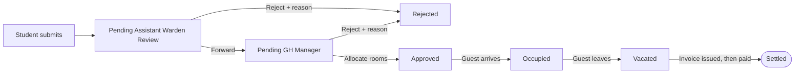
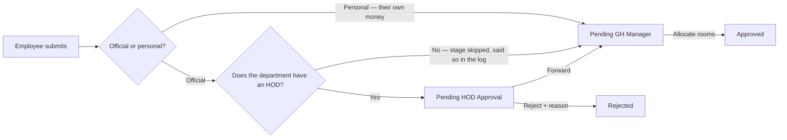
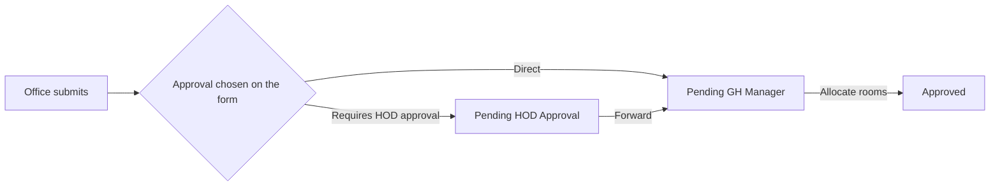
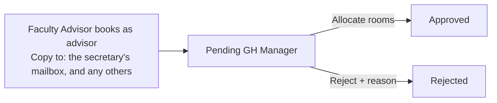
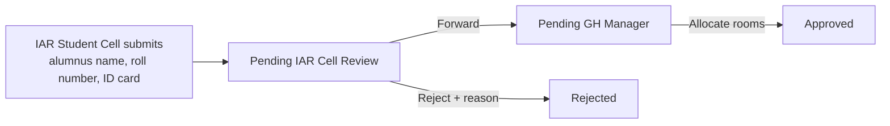
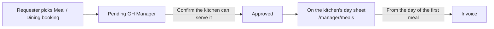
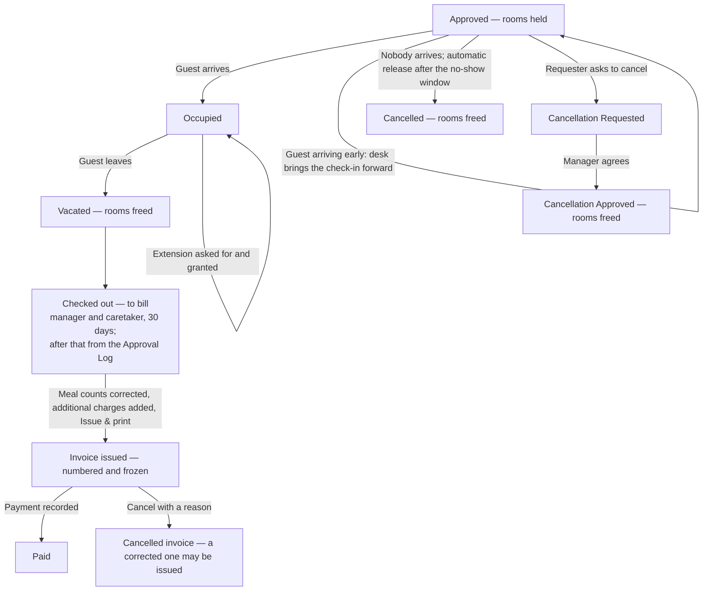
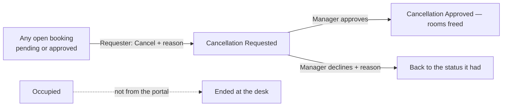

# Workflows

What each person does, and where a request goes when they do it. This is the
portal as the office works it — one section per role, then the pipelines drawn
out, then the states a booking can be in.

The role-by-role feature list is [10-roles-and-features.md](10-roles-and-features.md);
what each form asks is [11-booking-forms.md](11-booking-forms.md).

Everything here is enforced in `lib/workflow.ts` (routing and permissions),
`lib/units.ts` (who heads what), `lib/access.ts` (what a role may open) and
`lib/invoice.ts` (what may be billed). If this page and the code disagree, the
code is right and this page is a bug.

---

## 1. The people

| Role | Portal home | What they do |
| --- | --- | --- |
| Student | `/dashboard` | Books for family. Their Assistant Warden reviews it. |
| Employee (faculty or staff) | `/dashboard` | Books officially (HOD approves) or personally (straight to the manager). |
| Official / dignitary office | `/dashboard` | Books for the institute's guests. Chooses **Direct** or **Requires HOD approval** per booking. |
| Club / fest / council account | `/dashboard` | **Does not book** (24 Sep 2026). Sees and follows the bookings its Faculty Advisor raises for it, and gets every mail about them. A council's account is its secretary's mailbox (`sec_arts@`). |
| IAR Student Cell | `/dashboard` | Raises alumni bookings. The IAR Office reviews. |
| IAR Office | `/iar` | Reviews the Student Cell's requests, and books for its own office. |
| Assistant Warden | `/warden` | Reviews their own hostel's students' requests. |
| Faculty Advisor (a professor, by appointment) | `/dashboard`, `/book` | **Books for their council, fest and the clubs under it** — "Booking as: Faculty Advisor — X" on New Booking, straight to the GH Manager. Not a role: whoever Departments & Clubs → Faculty Advisors names now (a club's own, else its council's). |
| Council secretary (a student) | `/approvals` | Reviews club requests stored before 24 Sep 2026 (the old club stage). Their mailbox is copied on the advisor's bookings. |
| HOD (by appointment, not by role) | `/hod` | Reviews official requests from their department, its staff and its office. |
| Guest House Manager | `/manager` | Allocates rooms, approves, runs the desk, issues invoices, takes bookings for people who cannot use the portal. |
| Guest House Caretaker | `/caretaker` | Marks arrivals and departures, and issues the invoice — including after check-out, from "Checked out — to bill". Sees the same stays table as the manager. |
| Developer | `/admin` | Settings, accounts, units, tariffs, forms, mail templates, audit. |

**Approval by appointment.** An HOD is whoever heads the unit *now* (Console →
Departments & Clubs), not whoever holds a particular role: a council secretary
is a student, an HOD is an employee. Change the head and the waiting requests
move with them — nothing is stamped onto the booking. A **Faculty Advisor** is
the same idea for booking rather than approving: the professor named on the
council (migration 25), changed there when the one- or two-year appointment
ends.

**Nobody approves their own request.** `canReview` refuses it outright, and
routing skips a stage the requester would be approving themselves.

---

## 2. The pipelines

### 2.1 A student's stay

The warden is scoped to their own hostel: `warden.hostel_name` must match the
student's. Since 25 Sep 2026 the warden reviews each request beside the
student's academic record, with every Father / Mother / Guardian on the
request checked against the names on file (`lib/academic/family.ts`).

### 2.2 An employee's stay

Faculty and non-teaching staff take the same route; the debitable heads on
offer differ (`lib/debit-heads.ts`).

### 2.3 An office's stay (Director's Office, a department office, the IAR Office)

The choice is stored on the booking (`office_approval`), so the route cannot
change under a waiting request. An officer office (`office_class = 'officer'`)
is debited to the Institute Grant; a department office to the Department.

### 2.4 A club's, fest's or council's stay

The student bodies are a hierarchy: **Faculty Advisor → student secretary
(Technical Affairs, Cultural Affairs…) → clubs**, and a fest has an advisor of
its own. Since 24 Sep 2026 none of them books for itself: the **Faculty
Advisor** — a professor named in Departments & Clubs, the club's own else its
council's — books for it from their own login (`/book?for=<club>`, "Booking
as"). The booking is the club's — its account, its debitable heads — with the
professor as `created_by`, and **nobody forwards it**.

A club request stored before the rule (demo booking 2) still takes the old
route: Pending Club Approval with the council secretary first, then the HOD
where the club has one.

### 2.5 An alumnus's stay

Alumni have no institute login, so nobody books as one: the IAR Office or the
Student Cell raises it for them.

### 2.6 Dining (meals only, no room)

Lunch for a visitor is the kitchen's business; the approval stages exist to
vouch for an overnight stay, so a meals-only booking skips them all. No room is
held, nobody is checked in, and the bill may be issued from the day of the
first meal.

### 2.7 The desk, once a stay is approved

### 2.8 A requester cancels

A requester (or the Faculty Advisor who raised a club booking) never cancels
outright: every cancel is a request the manager decides, pending bookings
included. The manager cancels directly (`managerCancelBooking`), and the
developer can force any status from the console.

**Moving the dates at the desk** (manager or caretaker): a later check-out,
or since 25 Sep 2026 an earlier check-in — an approved or current stay, at
most 60 days either way, refused if another stay (or its turnaround) holds
one of the rooms by then. Without the earlier check-in, a guest arriving a
day early could not be marked Occupied, which is refused before the booked
check-in.

A room is held exactly while the booking is in a room-holding status, so
check-out, cancellation and the no-show release all free the room with no
separate step. What the room *was* is kept on the booking's room cards, because
that is what the invoice is priced from.

---

## 3. The states

| Status | Meaning | Who moves it on |
| --- | --- | --- |
| `PENDING_WARDEN` | With the student's Assistant Warden | Warden |
| `PENDING_FA` | With the club's advisor or council secretary | That person |
| `PENDING_HOD` | With the department's head | HOD |
| `PENDING_IAR` | With the IAR Office | IAR Office |
| `PENDING_GH_MANAGER` | Waiting for rooms | Manager |
| `APPROVED` | Rooms held, guest not yet in | Desk |
| `OCCUPIED` | Guest in the building | Desk |
| `VACATED` | Guest gone, room free | Manager (the bill) |
| `CANCELLATION_REQUESTED` | Requester asked to cancel (from any open status) | Manager |
| `CANCELLATION_APPROVED` | Cancelled at the requester's ask | — |
| `REJECTED` | Refused, with a reason the requester sees | — |
| `CANCELLED` | Cancelled by the office, or released as a no-show | — |

A stay is only ever shown as Occupied once it has actually started
(`displayStatus`): a guest admitted early reads as Approved with the arrival in
the log, because a badge saying "Occupied" on a booking for next week is a lie
the desk has to argue with.

---

## 4. What happens automatically

| When | What | Where |
| --- | --- | --- |
| Every submission and decision | Mail to the actioner, copy to everyone who has signed it off so far | `lib/mail/notify.ts` |
| Every mail to the requester | Copied to the booking's own **Copy to** addresses (New Booking — pre-filled with the council secretary's mailbox when a Faculty Advisor books), and on a club booking to the Faculty Advisor who raised it | `requesterCopyTo` in `lib/mail/recipients.ts`, `defaultCopyToFor` in `lib/club-booking.ts` |
| Every night | No-show release, ID-number erasure past the retention window, audit trimming | `/api/mail/cron` (Vercel Cron) |
| Every few minutes | The mail outbox is dispatched | `/api/mail/dispatch` |
| Any change to bookings, holds, blocks or invoices | Open desk screens re-fetch | `components/live-updates.tsx` |
| Any change to Settings, guest houses or rooms | The public site's cached data is expired | `lib/revalidate.ts` |

---

## 5. Where each rule actually lives

| Question | Answer in code |
| --- | --- |
| Who reviews this? | `routeFor`, `approvalStagesFor`, `canReview` / `canReviewBooking` (`lib/workflow.ts`) |
| Who may book for a club? | `facultyAdvisorOf` (`lib/units.ts`), `facultyInChargeOf`, `clubsBookableBy` (`lib/club-booking.ts`) |
| Who heads this unit? | `approversOf`, `hodApproversFor` (`lib/units.ts`) |
| May this role open this page? | `lib/access.ts`, and each page's own guard |
| What may be charged? | `invoiceBlocker`, `buildInvoiceDocument` (`lib/invoice.ts`) |
| How long may a stay be, how far ahead? | `lib/settings.ts` (`rules.booking`), applied by `lib/booking-schema.ts` |
| When may the desk check someone in? | `occupancyNotStartedError` (`lib/workflow.ts`) |
| Which rooms are free? | `room_holds` and `room_blocks` in the database, `lib/availability.ts` on top |

The public `/guidelines` page is rendered from the same modules
(`lib/site-content.ts` → `lib/site-data.ts`), so the rules the institute reads
are the rules the form applies.
